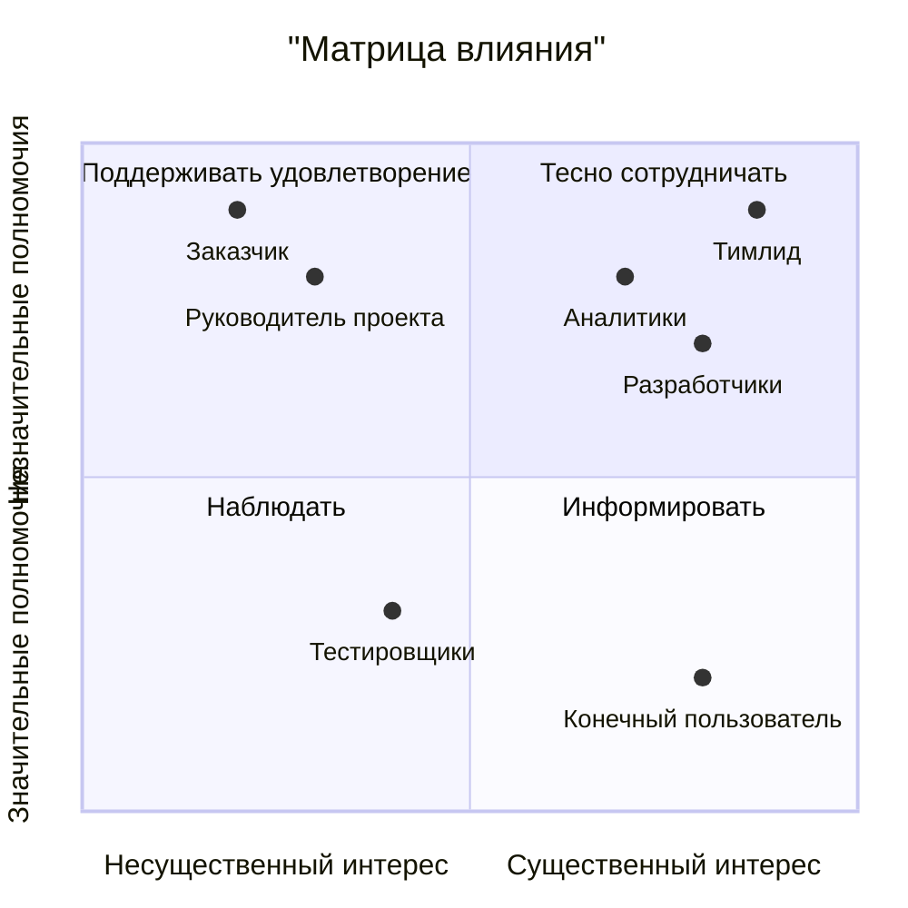

# project-practicum-diplom

## Обоснование технологии
| Критерий                                | Python | C# | Сравнение                                                                                                                                       |
|-----------------------------------------|--------|----|-------------------------------------------------------------------------------------------------------------------------------------------------|
| Простота                                |   1    |  0 | Python обладает простым и интуитивным синтаксисом, что делает его идеальным выбором для быстрой и легкой разработки.                            |
| Производительность                      |   0    |  1 | C# известен своей высокой производительностью, особенно при использовании .NET платформы, что обеспечивает быстрое выполнение программ.         |
| Гибкость                                |   1    |  0 | Python предлагает большую гибкость в решении различных задач благодаря широкому выбору инструментов и библиотек.                                |
| Надежность                              |   1    |  0 | Python является надежным языком программирования, проверенным временем и широко используемым в критически важных системах.                      |
| Скорость выполнения                     |   0    |  1 | C# обычно обеспечивает более высокую скорость выполнения программ, особенно при использовании .NET платформы.                                   |
| Разработка пользовательского интерфейса |   0    |  1 | C# предпочтительнее для разработки пользовательского интерфейса благодаря интеграции с различными инструментами и библиотеками для создания GUI.|

Общий вывод: Python идеально подходит для разработки информационной системы мониторинга работы баз данных из-за своей простоты, гибкости и надежности. Однако, если необходима повышенная производительность или разработка пользовательского интерфейса с использованием GUI, то C# может быть предпочтительнее.

## Матрица влияния

## Список операций проекта
| Код | Операция                                          | Срок выполнения | Описание работ                                                              |
|-----|---------------------------------------------------|---------|-------------------------------------------------------------------------------------|
|01   | Концептуализация                                  |6 недель |                                                                                     |
|01.01| Изучение существующих решений и анализ требований |3 недели | Анализ существующих систем мониторинга и определение требований к новому продукту   |
|01.02| Определение основной концепции и функционала      |2 недели | Выработка общей концепции системы мониторинга и определение основного функционала   |
|01.03| Проработка дизайна и пользовательского интерфейса |1 неделя | Разработка прототипа пользовательского интерфейса и его визуального оформления      |
|02   | Планирование                                      |4 недели |                                                                                     |
|02.01| Определение сроков и ресурсов                     |2 недели | Определение временных рамок и ресурсов для разработки информационной системы        |
|02.02| Составление технического задания                  |2 недели | Составление подробного технического задания, включающего в себя требования к системе|
|03   | Разработка                                        |10 недель|                                                                                     |
|03.01| Написание кода и создание базы данных             |4 недели | Разработка и тестирование основной функциональности системы, включая базу данных    |
|03.02| Разработка пользовательского интерфейса           |3 недели | Создание пользовательского интерфейса системы, в соответствии с дизайном            |
|03.03| Реализация механизмов мониторинга и уведомлений   |3 недели | Написание кода для мониторинга работы баз данных и уведомления об аномалиях         |
|04   | Тестирование и завершение                         |5 недель |                                                                                     |
|04.01| Тестирование и отладка                            |4 недели | Проведение тестирования системы и устранение обнаруженных ошибок                    |
|04.02| Документация и подготовка к выпуску               |1 неделя | Подготовка документации по системе и подготовка к выпуску в эксплуатацию            |
|04.02| Поддержка и обновление                            |бессрочно| Поддержка и обновление  после  выпуска, внесение изменений по мере необходимости    |
